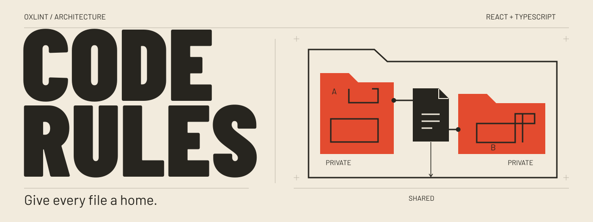

# Code Rules



[](https://www.npmjs.com/package/oxlint-plugin-code-rules)
[](https://github.com/g-bastianelli/oxlint-plugin-code-rules/actions/workflows/ci.yml)
[](LICENSE)

**Give every file a home.** Architecture rules for React and TypeScript, powered by Oxlint.

Code Rules follows your imports to suggest where components, hooks, types and tests
belong. Private files live with their owner. Shared files live at their consumers'
nearest common ancestor. Eight opt-in rules also keep module boundaries, entry
points and naming explicit.

[Rules](#rules) · [Changelog](CHANGELOG.md) · [Report an issue](https://github.com/g-bastianelli/oxlint-plugin-code-rules/issues)

## See what it catches

If `Orders.tsx` is the only component that renders `OrderRow.tsx`, the row belongs
under `Orders/`. The plugin reports the expected location and its consumers.

```text
Before                      Suggested structure
src/                        src/
├── Orders.tsx              └── Orders/
└── OrderRow.tsx                 ├── index.tsx
                                └── OrderRow.tsx
```

If another component starts using the row, its suggested location becomes their
nearest common ancestor. Hooks and types follow the same ownership model; tests
and stories stay beside their subject.

The example uses `index.tsx`, but the rules do not require it. They report
placements; they do not move files or rewrite imports.

## Quick start

Requires Node.js `^20.19.0 || >=22.12.0` and Oxlint `^1.85.0`.
The package is ESM and needs no build step or global installation.

```sh
npm install --save-dev oxlint oxlint-plugin-code-rules
# or
bun add -d oxlint oxlint-plugin-code-rules
```

Add the plugin and the rules you want to your `.oxlintrc.json`:

```json
{
  "jsPlugins": [{ "name": "code-rules", "specifier": "oxlint-plugin-code-rules" }],
  "rules": {
    "code-rules/component-ownership": "warn",
    "code-rules/module-ownership": "warn",
    "code-rules/test-colocation": "warn",
    "code-rules/no-deep-import": "warn",
    "code-rules/declarative-entry": "warn",
    "code-rules/no-nested-jsx-map": "warn",
    "code-rules/no-catch-all-module": "warn",
    "code-rules/no-enum": "warn"
  }
}
```

Run `npx oxlint` or `bunx oxlint`. Start with warnings to review the suggestions,
then switch individual rules to `"error"` when they fit your project.
No rule is enabled implicitly. The ownership rules share one graph per root.

## Rules

All rule names use the `code-rules/` prefix.

| Rule                                          | What it checks                                                             |
| --------------------------------------------- | -------------------------------------------------------------------------- |
| [`component-ownership`](#component-ownership) | React components live under their owner, or beside their shared consumers. |
| [`module-ownership`](#module-ownership)       | Hooks, types, schemas and helpers follow the same ownership graph.         |
| [`test-colocation`](#test-colocation)         | Tests and stories live beside their subject.                               |
| [`no-deep-import`](#no-deep-import)           | Imports go through a folder's public entry point.                          |
| [`declarative-entry`](#declarative-entry)     | Module entry points contain declarative composition.                       |
| [`no-nested-jsx-map`](#no-nested-jsx-map)     | Nested JSX lists get their own component.                                  |
| [`no-catch-all-module`](#no-catch-all-module) | Modules have a specific name instead of `utils` or `helpers`.              |
| [`no-enum`](#no-enum)                         | TypeScript enums become literal unions.                                    |

### component-ownership

Checks PascalCase `.tsx` and `.jsx` files containing JSX, and component folders
such as `Child/index.tsx` or `Child/Child.tsx`. The diagnostic points to the first
JSX node. Type-only consumers do not own components.

### module-ownership

Checks other modules, including hooks, types, schemas, helpers, contexts and
encapsulated module folders. Type imports count as consumers. A grouping folder's
`index.*` is never moved. The diagnostic points to the first statement.

### test-colocation

Checks `*.test.*`, `*.spec.*`, `*.e2e.*`, `*.bench.*`, `*.stories.*` and files under
`__tests__/`, `__fixtures__/`, `__mocks__/` or `__snapshots__/`. The subject is an
imported module with the matching name: `useOrders.test.ts` → `useOrders.ts`,
`user.service.test.ts` → `user.service.ts`, `Orders/index.test.tsx` → `Orders/`.
Tests can live beside their subject or in one of its support subfolders.
Without a unique subject, the rule makes no suggestion.

### no-deep-import

A component folder with an entry point, or a lowercase folder whose `index`
re-exports files inside it, is a facade. Outside consumers must use that entry.
The rule checks imports, re-exports and literal dynamic imports, and names the
outermost facade being crossed. Descendants of the folder, tests, test support
files behind the facade and folders without an entry are exempt.

An `index` without re-exports, such as a file-based route, does not create a
module facade. Between packages, `package.json#exports` defines public paths;
this rule applies boundaries inside a package.

### declarative-entry

An `index.ts`, `.mts`, `.js` or `.mjs` contains imports, named re-exports and
declarative composition such as `export const router = createRouter(…)`.
The rule reports `if`, `switch`, `try`, `throw` and loops anywhere in the file,
as well as top-level calls and `await`. Component `index.tsx` files are exempt.
A package's root entry without an `exports` field is treated as a program and
is also exempt.

### no-nested-jsx-map

Reports `.map` or `.flatMap` inside another map callback in rendered JSX.
Extract the inner list into its own component. Adjacent lists and lists computed
outside JSX are exempt.

### no-catch-all-module

Reports `utils`, `util`, `helpers`, `helper`, `misc` and `common`, including
suffixes such as `string-helpers.ts`. Give the module the name of its responsibility.
Tests follow their subject and are exempt. `names` replaces the default list;
`allow` lists tolerated path suffixes, for example a generated shadcn file:

```json
{
  "code-rules/no-catch-all-module": ["warn", { "allow": ["lib/utils.ts"] }]
}
```

### no-enum

Reports TypeScript `enum` declarations, including `const enum`.
Prefer a union of literals.

## How ownership works

The graph identifies owners from the source tree and its imports:

- A standalone PascalCase component owns its proposed component folder.
- A component folder owns its contents.
- A module folder with an `index.ts` owns its contents when outside consumers use
  only that entry. Deep imports make it a grouping folder instead.
- A standalone module inside an owner acts for that owner without creating a folder.
- Wiring outside an owner, such as `main.tsx` or a route registry, does not own
  its imports and does not suggest moving them.

One owner means a private file belongs under that owner. Multiple owners mean it
belongs at their nearest common ancestor. No consumers means no placement inference.
Tests and stories never own components or modules.

Lowercase folders such as `command-palette/`, `data-access/`, `reorder/` and
`_shared/` define grouping boundaries. After an optional `_`, the name starts
with a lowercase letter and contains lowercase letters, digits and hyphens
between nonempty segments. PascalCase folders remain subject to ownership.

The nearest grouping boundary applies. Outside consumers count at that boundary's
root, so a feature stays in its own folder. A deeply nested file used from outside
must move up to that root. Private children remain checked at every depth, and
tests remain colocated even across a boundary. A grouping entry point never
causes the entire group to move.

Folder names express an architectural decision; they do not prove domain cohesion.
Renaming a folder to kebab-case changes its interpretation. Test support folders
are outside the ownership model: only their colocation is checked.

## Roots and monorepos

By default, each file is analyzed within the nearest package's `src/`, or the
package itself if it has no `src/`. A workspace root with `workspaces` but no
`src/` is skipped. One configuration can cover a monorepo; files outside the
selected `src/` are not analyzed.

To choose a root explicitly, pass `root` to an ownership rule:

```json
{
  "code-rules/component-ownership": ["warn", { "root": "src" }]
}
```

The root is absolute or relative to the linter's working directory. Include
**all consumers** in the chosen scope. Oxlint diagnostic exclusions do not shrink
the graph: an ignored file can still consume a module.

## Resolution and limits

Oxc resolves `tsconfig` aliases, `.js` imports pointing to TypeScript, conditional
`exports` (`node`, `import`) and literal dynamic imports. Protocol imports such
as `node:`, `bun:`, `cloudflare:` and `virtual:` are external.

Re-exported files and source targets of `package.json#exports` are protected.
Ownership cycles receive no suggestion. A type re-export protects a type module,
but not the component declaring those types. Unresolved type-only links do not
suspend analysis. A root `index.*` wires the package without owning its imports.

When the graph is incomplete because of a parse error, an unresolved code import,
a computed dynamic import, `require` or a computed `import.meta` call, each enabled
ownership rule explains once why analysis is suspended. Common generated folders
(`node_modules`, `.git`, `.moon`, `dist`, `build`, `coverage`, `paraglide`) and
`.d.ts` files are excluded. Symlinks are not followed. PascalCase `.tsx` files
without JSX receive no diagnostic.

Placement suggestions can take several passes: moving an owner changes the
expected location of its children. Messages include the file, expected location
and consumers; beyond four consumers they show three and count the rest.

## Performance and editor support

The plugin uses `createOnce`, targeted visitors and `before` to skip files without
diagnostics. Rules share file resolution and an import graph built from Oxc's ESM
summary; an extra AST is created only for computed imports or non-ESM forms.

The cache is shared within a synchronous batch. Between batches, file, directory
and ancestor JSON configuration metadata are checked again. Changes trigger
reparsing; current-buffer edits also invalidate the graph. The cache holds at
most 64 roots, with no persistent watcher or disk cache.

Oxlint's current buffer is used; other files are read from disk. Unsaved edits in
other buffers are unavailable. Changes to extended configurations outside the
root and its ancestors require a linter restart. A real `oxlint --lsp` test covers
opening a file, editing its buffer and adding a saved consumer. Changes in another
file take effect at the component's next lint; the plugin does not request that
Oxlint relint dependents.

The benchmark runs Oxlint on 6,400 files in six-level trees. After warmup, five
runs alternate with and without the three ownership rules. It checks diagnostics,
writes `bench/results.json` and enforces a local median budget of 1,000 ms.
That budget depends on the machine; it is not a published throughput guarantee.

## Development

```sh
bun install --ignore-scripts
moon run code-rules:test
moon run code-rules:lint
moon run code-rules:format
moon run code-rules:benchmark
```

Moon requires initialized Git history. Underlying commands are in `moon.yml`.
Tests use `node:test`, Oxlint's official `RuleTester` and the real binary. Fixtures
create temporary folders that are cleaned up after each test. A packaging test
installs the archive into a temporary project and loads the plugin by package name.

CI checks tests, lint and formatting on Node 20, 22 and 24. Oxlint's `RuleTester`
requires Node 22; Node 20 skips that suite and runs the real-binary tests.

### Release

1. Update `version` in `package.json` and `meta.version` in `src/index.js`.
2. Commit and push a matching `v<version>` tag.
3. The Release workflow checks the tag, runs validation, publishes to npm with
   provenance and creates the GitHub release.

Publishing uses npm trusted publishing (OIDC) when configured, or the repository's
`NPM_TOKEN` secret. Dependencies are pinned. Compatibility is tested with Oxlint
1.85.0 and 1.86.0; its JavaScript plugin API is still alpha.

The default entry export is Oxlint's expected plugin format; internal modules use
named exports. Add rules separately in `src/rules/`, without implicit activation
or duplicating native Oxlint rules.

## References

- [JavaScript plugin configuration](https://oxc.rs/docs/guide/usage/linter/js-plugins.html)
- [Plugin API, createOnce, before and RuleTester](https://oxc.rs/docs/guide/usage/linter/writing-js-plugins.html)
- [Native multi-file analysis](https://oxc.rs/docs/guide/usage/linter/multi-file-analysis)

The caching approach is an implementation choice, not an Oxlint lifecycle guarantee.
Rerun the benchmark when upgrading the engine.

## License

[MIT](LICENSE) — Guillaume Bastianelli.
